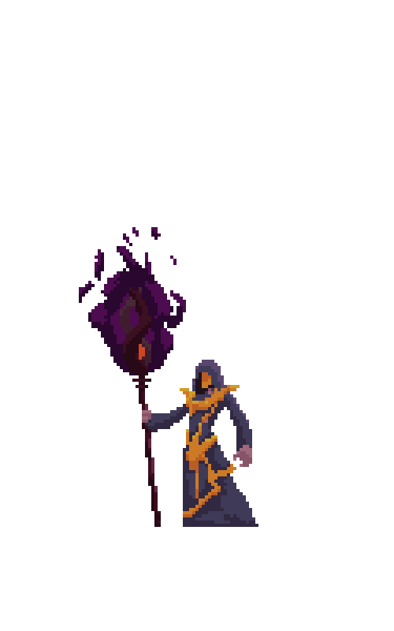
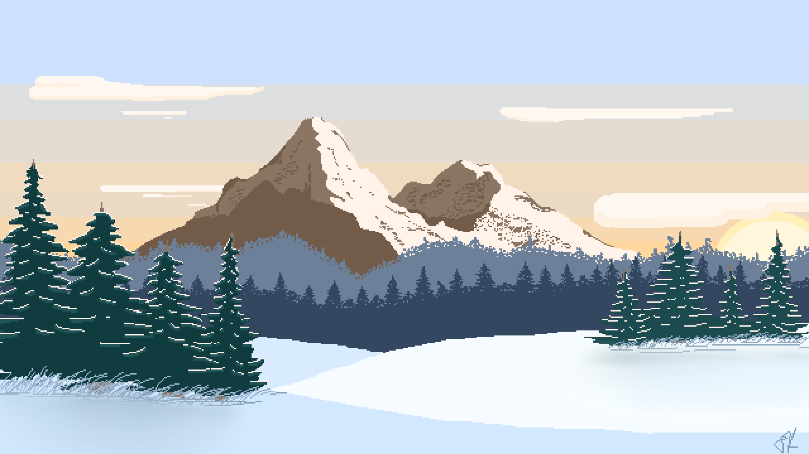

# SPRITE CLUB

**VERSION 1.0.0**
Sprite Club is a place where you can battle sprites! One on one, colosseum-style, or build characters and have them auto-fight. The choice is yours. 

# ABOUT THE GAME

A one or two player turn-based battle game that allows you to choose from different classes of sprites and fight it out. 

Either choose to fight, use an ability, or heal on your turn. When a player's hitpoints (HP) gets to zero, that player loses and the round is over. 

Here's a link to [Sprite Club](https://504aguiluz.github.io/sprite-battle-proto/)

# WIREFRAME

# TECHNOLOGY

- HTML/CSS
- JavaScript for game logic and animation triggers

# ASSETS

## IMAGES

### ANIMATION SAMPLES

### BACKGROUND IMAGES

## MUSIC

[Warrior Music](#hip-hop7)
[Cleric Music](#hip-hop2)

## SFX

[Sword hit sfx](#sword-hit-sfx)
[Fireball Spell sfx](#explosion-sfx)
[Heal sfx](#heal1-sfx)

# MVP

- title screen opens with a start game button
- two players and their stat screens populate upon starting game
- character with initiative's background image populates 
- 3 action options: 
    + fight
    + character ability
    + heal
- when a player reaches 0HP, they lose the round

# STRETCH GOALS (**version 2.0**)

- accessibility features so that I'm not left out of enjoying the game
- to be able to choose from a larger number of character classes (rogue, monk, paladin, druid, etc.)
- to battle with and against teams of multiple characters (NPC optional)
- to be able to choose from multiple spell options
- to make custom abilities for each character
- to be able to level up when I win multiple battles based on XP earned
- to be able purchase new gear to buff stats with GP I acquire upon winning battles 

# SUPER STRETCH GOALS (**version 3.0**)

-to make this app an online player-to-player experience, where players log-in and compete in leaderboards
-to integrate this app with actual DnD-style classes that utilize real mechanics to level up players and allow new spells, abilities, armor, weapons, etc.
-to create a character building page so that players can design their own characters
-to create an auto-battle feature that would allow you to set parameters for battles ahead of time and watch them play out automatically when the battle begins

